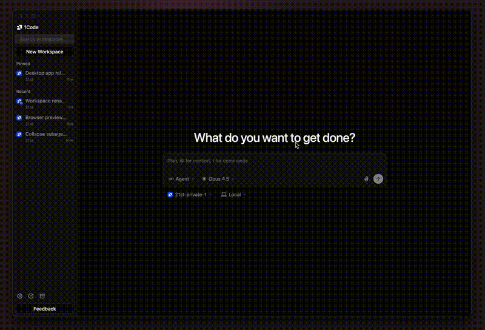

# 1Code (Enterprise Fork)

A local-first desktop client for running AI coding agents (Claude Code, Codex, Ollama) against your own repositories.

> **About this fork.** This is an enterprise fork of [1Code by 21st-dev](https://github.com/21st-dev/1code), progressively decoupled from the upstream `1code.dev` hosted backend in favor of self-hosted infrastructure (LiteLLM, Microsoft Entra ID via Envoy Gateway). See [`docs/enterprise/fork-posture.md`](docs/enterprise/fork-posture.md) for the full context, and [`docs/enterprise/upstream-features.md`](docs/enterprise/upstream-features.md) for the upstream-feature catalog (F1-F10).



## Highlights

These features run entirely on your machine — no hosted backend required.

- **Multi-Agent Support** — Claude Code, Codex, and Ollama in one app; switch instantly
- **Cursor-like Visual UI** — Diff previews and real-time tool execution
- **BYOK** — Use your own API keys for any supported provider
- **Git Worktree Isolation** — Each chat session runs in its own isolated worktree, never touching `main`
- **Built-in Git Client** — Visual staging, diffs, branch management, PR creation
- **Kanban Board** — Visualize agent sessions across worktrees
- **File Viewer** — Cmd+P fuzzy file search, syntax highlighting, image viewer
- **Integrated Terminal** — `node-pty` + xterm.js, toggle with Cmd+J
- **Model Selector** — Switch models and providers per-chat
- **MCP Server Management** — Toggle, configure, and delete MCP servers from the UI; SSRF-safe URL validation
- **Skills & Slash Commands** — User-defined skills and slash commands surfaced in chat
- **Custom Sub-agents** — Visual task display in the details sidebar
- **Memory** — Reads `CLAUDE.md` and `AGENTS.md` from the project root
- **Chat Forking** — Fork a sub-chat from any assistant message
- **Message Queue** — Queue prompts while an agent is working
- **Plan Mode** — Structured plans with markdown preview before execution
- **Extended Thinking** — Visual thinking gradient for Claude reasoning
- **Auto-Updates** — `electron-updater` polling GitHub Releases for new versions (see [`docs/operations/release.md`](docs/operations/release.md))
- **Cross Platform** — macOS, Windows, Linux

### Upstream-dependent features

Several features depend on the upstream `1code.dev` hosted backend and will stop functioning once it's retired. Per the fork's **self-host-everything** theme, each will be reverse-engineered and self-hosted rather than dropped. See [`docs/enterprise/upstream-features.md`](docs/enterprise/upstream-features.md) for the full F1-F10 catalog with per-feature restoration status and priorities.

## Installation

This fork is build-from-source. There are no pre-built enterprise releases yet.

```bash
# Prerequisites: Bun, Python 3.11 (or 3.12+ with setuptools), Xcode Command Line Tools (macOS)
bun install
bun run claude:download  # Download Claude binary (pinned 2.1.96) — required
bun run codex:download   # Download Codex binary (pinned 0.118.0) — required
bun run build
bun run package:mac      # or package:win, package:linux
```

> **Important:** The `claude:download` and `codex:download` steps fetch the pinned agent CLI binaries. Skipping them produces a build that compiles but cannot run agents.
>
> **Looking for the upstream OSS product?** Pre-built releases of upstream 1Code are available from [1code.dev](https://1code.dev). This fork is a separate distribution.

See [`CONTRIBUTING.md`](CONTRIBUTING.md) for development setup, Python notes, and the full build workflow.

## Development

```bash
bun install
bun run claude:download  # First time only
bun run codex:download   # First time only
bun run dev
```

## Feedback & Community

Community and feedback channels are configured via environment variables (`VITE_COMMUNITY_URL`, `VITE_FEEDBACK_URL`). See `.env.example` for setup. For bug reports and feature requests, open a GitHub issue.

## Developer Guide

**Canonical documentation** lives under [`docs/`](docs/) — a tracked xyd-js site with five tabs:

- [`docs/architecture/`](docs/architecture/) — codebase layout, database schema, tech stack, tRPC routers, upstream boundary
- [`docs/enterprise/`](docs/enterprise/) — auth strategy, upstream feature catalog (F1-F10), Phase 0 gates, cluster facts
- [`docs/conventions/`](docs/conventions/) — pinned deps, quality gates, regression guards, brand taxonomy
- [`docs/operations/`](docs/operations/) — release process, debugging first install, cluster access, env gotchas
- [`docs/api-reference/`](docs/api-reference/) — API reference material

For Claude Code-specific guidance, see [`CLAUDE.md`](CLAUDE.md). For contribution guidelines and setup, see [`CONTRIBUTING.md`](CONTRIBUTING.md).

## License

Apache License 2.0 - see [LICENSE](LICENSE) for details.
