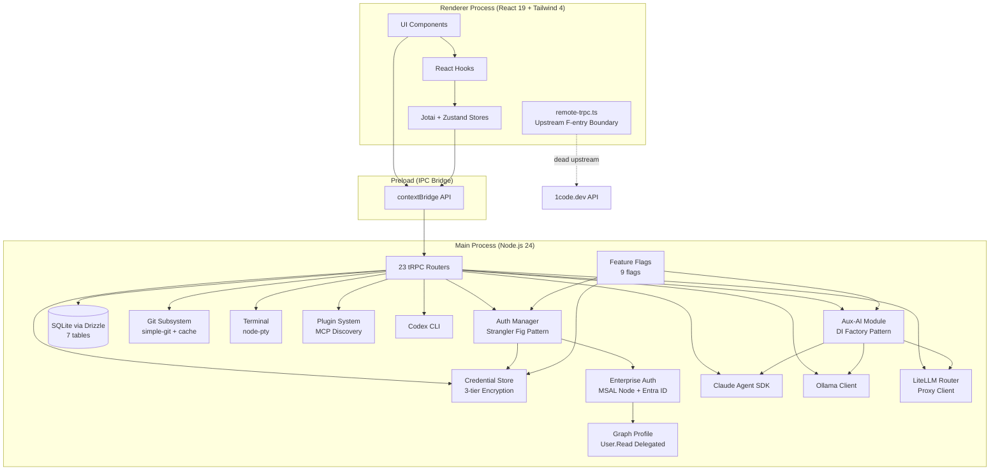
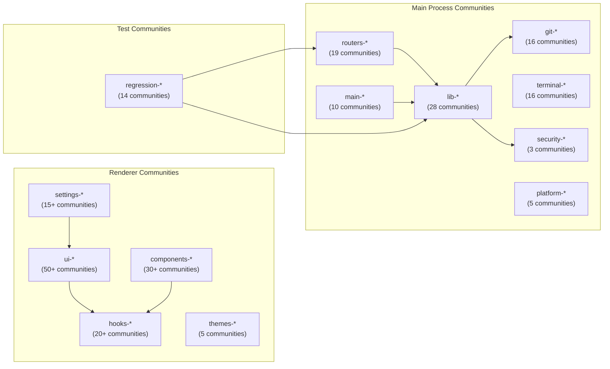
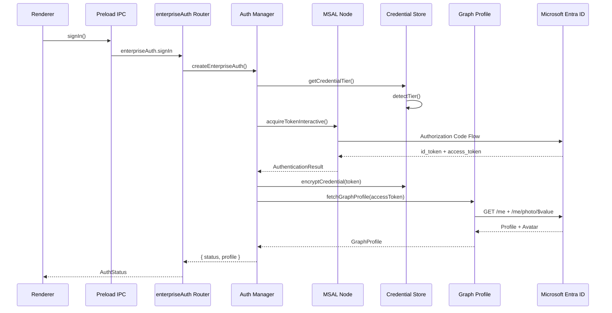
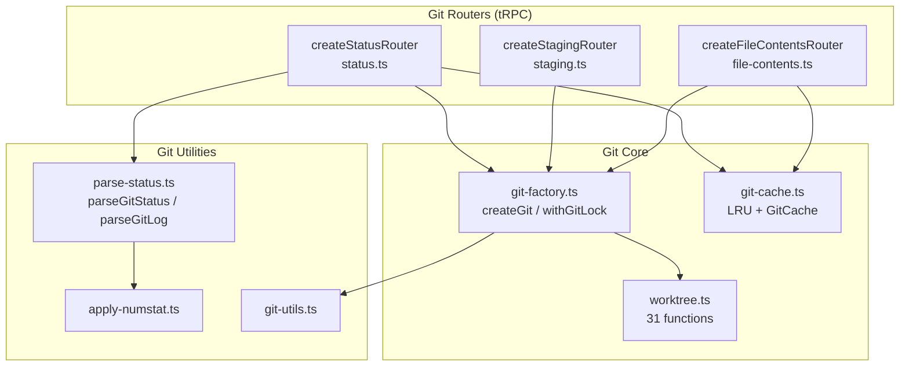
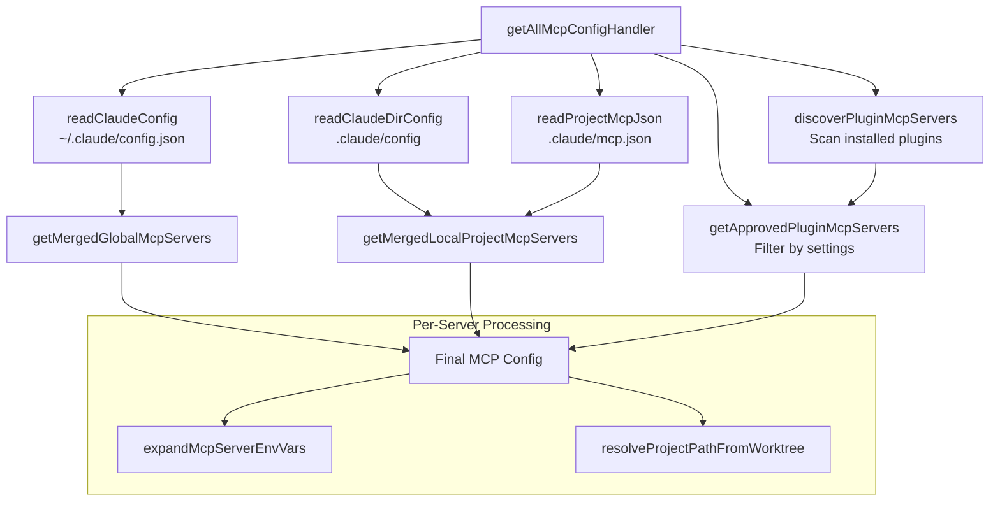

# Architecture Diagrams

Visual representations of the codebase structure derived from the code knowledge graph.

## Three-Layer Electron Architecture

## Community Clustering -- High-Level Domains

The Leiden algorithm detected 406 communities. Grouping by naming prefix reveals these high-level architectural domains:

## Largest Communities by Node Count

| Community | Size | Cohesion | Primary File |
|-----------|------|----------|-------------|
| ui-icon | 256 | 0.739 | Icon components (SVG exports) |
| ui-icon-2 | 220 | 0.987 | Canvas icon components |
| routers-codex | 59 | 0.324 | codex.ts tRPC router |
| icons-icon | 49 | 0.356 | Framework icons |
| icons-icon-2 | 45 | 0.786 | Icon index |
| git-branch | 33 | 0.196 | worktree.ts (31 functions) |
| lib-draft | 33 | 0.371 | drafts.ts (message drafts) |
| main-handle | 33 | 0.059 | Main window handlers |
| cache-invalidate | 30 | 0.782 | git-cache.ts (LRU + GitCache) |
| ui-handle | 29 | 0.183 | Agent diff view |

## Cohesion Analysis

### High-Cohesion Communities (well-encapsulated modules)

| Community | Cohesion | Interpretation |
|-----------|----------|---------------|
| cache-invalidate | 0.782 | LRUCache + GitCache -- tight internal coupling, clean API |
| main-auth | 0.407 | Auth manager -- reasonable encapsulation |
| lib-credential | 0.375 | Credential store -- 10 functions, well-bounded |
| lib-draft | 0.371 | Message draft management |
| routers-codex | 0.324 | Codex tRPC router -- large but self-contained |

### Low-Cohesion Communities (potential refactoring targets)

| Community | Cohesion | Interpretation |
|-----------|----------|---------------|
| routers-claude | 0.138 | Claude router -- many external dependencies |
| git-branch | 0.196 | Worktree module -- 31 functions, many cross-cutting concerns |
| lib-config | 0.273 | Claude config -- reads/writes across many systems |

## Auth Subsystem Flow

## Git Subsystem Architecture

## MCP Configuration Resolution

## File Distribution

| Layer | Files | % |
|-------|-------|---|
| src/renderer/ | ~300 | 50% |
| src/main/ | ~150 | 25% |
| tests/ | ~55 | 9% |
| services/1code-api/ | ~50 | 8% |
| scripts/ | ~15 | 3% |
| src/preload/ + src/shared/ | ~10 | 2% |
| Config/build | ~14 | 2% |
